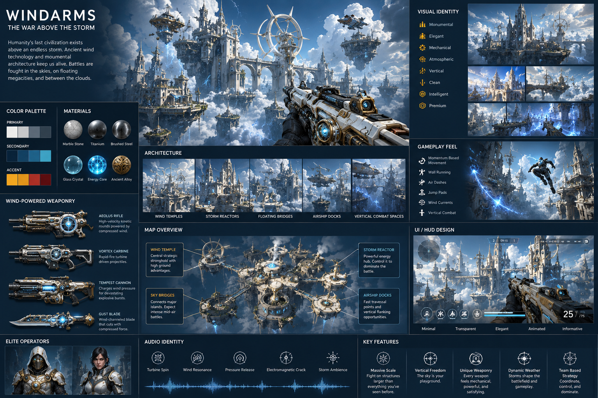

# WINDARMS — FOUNDING OPERATORS (Season Zero)

> Source: originally part of the "WINDARMS — FOUNDING OPERATORS (Season Zero)" doc written into `src/components/game/hud/CLAUDE.md`; split out into its own file during the docs restructure (2026-07-12). Content preserved verbatim. This is V2 design material — hero abilities are not implemented in the v1 build described in [../versions/v1.md](../versions/v1.md). Built on the rules and design template in [abilities.md](abilities.md); world context in [../design/lore.md](../design/lore.md).

You are the Creative Director, Lead Gameplay Designer, Systems Designer, Combat Designer, and Lore Director for **WindArms**.

Your task is to create the **first four playable operators** that will become the foundation of the WindArms universe.

# THE FOUR FOUNDING OPERATORS

Each operator represents one fundamental aspect of atmospheric combat.

## Operator 01 — Momentum Engineer

Theme:
Master of kinetic energy.

Core Passive:
Stores movement energy while sprinting, sliding, wall-running, air-dashing, falling, and grappling.

Signature Ability:
Release stored momentum into a powerful directional burst that can be used offensively or for advanced movement.

Ultimate:
Overcharge the kinetic reservoir, enabling extreme mobility for a short duration while preserving weapon accuracy.

Role:
High-skill mobility duelist.

---

## Operator 02 — Pressure Architect

Theme:
Shapes the battlefield by compressing air.

Core Passive:
Air structures form faster after consecutive successful placements.

Signature Ability:
Instantly create temporary solid-air structures such as walls, ramps, bridges, or elevated platforms.

Ultimate:
Generate a large atmospheric fortress zone with multiple pressure constructs that constantly evolve for several seconds.

Role:
Strategic controller.

---

## Operator 03 — Storm Synchronizer

Theme:
Uses the rhythm of the planet-wide storm.

Core Passive:
Actions performed in sync with storm pulses gain small efficiency bonuses.

Signature Ability:
Emit a localized storm pulse that briefly enhances nearby allies' movement and disrupts enemy stability.

Ultimate:
Call down a controlled atmospheric resonance field that changes combat flow by amplifying wind currents and altering traversal opportunities.

Role:
Support / battlefield coordinator.

---

## Operator 04 — Refraction Specialist

Theme:
Controls airflow to bend light.

Core Passive:
Movement leaves behind subtle atmospheric distortions that are difficult to track.

Signature Ability:
Create a localized refraction field that visually distorts the environment without making the operator invisible.

Ultimate:
Generate a large atmospheric mirage zone where perception is altered through realistic light refraction, forcing enemies to rely on awareness rather than visual certainty.

Role:
Recon / deception specialist.

---

# ART DIRECTION

The operators must visually belong to the same civilization.

Design language:

* White marble
* Titanium
* Brushed steel
* Electric cyan energy
* Mechanical turbines
* Rotating pressure mechanisms
* Wind reactors
* Clean engineering
* Elegant silhouettes
* Functional armor
* Premium AAA realism

Avoid oversized fantasy armor, glowing magical effects, and exaggerated sci-fi clichés.

See [../design/art-direction.md](../design/art-direction.md) for the full civilization-wide art direction this section belongs to.

---

